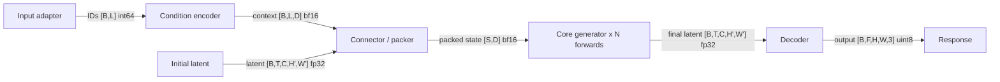

# Architecture Analysis

Use this workflow for autoregressive, diffusion, speech, image, video, and multimodal systems. Include only branches that exist in the target model.

## Contents

- [Safe repository reconnaissance](#safe-repository-reconnaissance)
- [Architecture map](#architecture-map)
- [Shapes and execution](#trace-shapes-and-dtypes)
- [Architectural mechanisms](#architectural-mechanisms)
- [Comparison and conclusions](#comparison-discipline)

## Safe repository reconnaissance

Pin the model and reference repository revisions first. Prefer static inspection:

```bash
rg --files | rg 'config|model|pipeline|processor|token|encoder|decoder|vae|scheduler|registry|test|recipe'
rg -n 'class .*Model|class .*Pipeline|forward\(|generate\(|decode\(|architectures|model_type'
```

Inspect, in order:

1. Model card, paper, configuration, and checkpoint index.
2. Public entrypoint and request/input processor.
3. Component construction and weight-loading path.
4. Forward, sampling, denoise, or decode loop.
5. Output decoder/postprocessor and response contract.
6. Tests that encode shape, dtype, task, and numerical contracts.

Do not execute remote `trust_remote_code`, import an untrusted checkout, or download large weights merely to answer structural questions. If execution is necessary, state why and obtain the needed authorization/environment.

## Architecture map

Start with a one-paragraph identity:

- architecture family and generation method;
- supported input and output modalities;
- model/checkpoint variants and task-specific partitions;
- shared versus duplicated components;
- the reference implementation used for comparison.

Distinguish the vendor's complete product/system, the publicly released checkpoint components, and the subset implemented by the target runtime. Do not attribute hosted preprocessing, upscaling, postprocessing, or unreleased components to the open checkpoint.

Then draw one Mermaid flowchart for the representative path. The diagram is the orientation layer, not a replacement for exact tables:



Adapt the nodes and branches to the model. Label every major data-bearing edge with a symbolic shape; add the canonical concrete shape and dtype when known. Keep at least one connected source-to-output path with two or more shape-labeled edges. For validator compatibility, put one solid data edge on each line and use either `A -->|"tensor [B,L,D] bf16"| B` or `A -- "tensor [B,L,D] bf16" --> B`. Show modality-specific inputs, packing/connector boundaries, recurrent decode or denoise loops, and separate output heads when they materially affect execution. Use a short `control: ...` label for a control-only edge rather than inventing a tensor. Put evidence IDs in the surrounding visible architecture prose because citations inside a code fence do not count.

Cross-check every diagram label against the representative workload and then build a component table:

| Stage/component | Source class/file | Parameters or config | Input -> output | Dtype/device | Residency/frequency | Evidence |
|---|---|---|---|---|---|---|

Common stages include input adapters, tokenizer/processor, text/audio/vision encoders, projection or connector layers, autoregressive backbone, diffusion transformer or U-Net, scheduler, vocoder, VAE, and postprocessor. `N/A` is preferable to inventing a stage.

## Trace shapes and dtypes

Trace at least one representative workload end to end. Record symbolic and concrete dimensions at boundaries:

- batch and request grouping;
- token or latent sequence length;
- channel/hidden/head dimensions;
- image height/width and patching;
- video frames, spatial compression, and temporal compression;
- audio samples, sample rate, frames, codebooks, or latent channels;
- packed-sequence boundaries and masks;
- parameter, activation, accumulator, and output dtypes.

For each transformation, cite the code/config that defines it. If a dimension is derived, show the formula and rounding/alignment behavior.

Useful generic relationships include:

```text
image_tokens = ceil(H / patch_h) * ceil(W / patch_w)
video_tokens = aligned_latent_frames * latent_height * latent_width / patch_volume
audio_duration = samples / sample_rate
dense_weight_bytes ~= parameter_count * bytes_per_stored_parameter
```

These are starting forms, not universal truths. Replace them with the model's actual padding, compression, packing, quantization metadata, and sharing rules.

## Execution semantics

Explain the loop that dominates inference:

- autoregressive: prefill, decode, cache growth, stopping, and streaming;
- diffusion/flow: conditioning, timesteps, guidance branches, denoise steps, and decode;
- codec/speech: token generation, acoustic decoding, vocoder, and streaming chunks;
- hybrid/omni: stage dependencies, cross-modal connectors, shared state, and synchronization.

State which components run once per request, once per step/token, or once per output. This is essential for later optimization ranking.

## Architectural mechanisms

Inspect rather than assume:

- attention layout: dense, local, block-sparse, cross-attention, packed variable length;
- positional encoding: 1D/2D/3D RoPE, learned positions, interpolation, or relative bias;
- conditioning: concatenation, cross-attention, AdaLN/modulation, prefix tokens, or side networks;
- expert routing, multiple prediction heads, guidance/distillation, and scheduler math;
- weight tying, component sharing, task partitions, and dynamic module selection;
- parallelism hooks and hardware-specific operator selection.

For full attention with sequence length `L`, total attention work is approximately proportional to `L^2 * d`. With sequence-parallel degree `R`, balanced per-rank compute is roughly `1/R` of total plus communication; do not incorrectly describe it as `(L/R)^2` without accounting for the distributed keys/values and collectives.

## Comparison discipline

When comparing the vendor/reference implementation with a runtime implementation, use a semantic mapping:

| Reference behavior | Runtime behavior | Equivalent? | Evidence | Consequence |
|---|---|---|---|---|

Check configuration defaults, preprocessing, tensor layout, masks, scheduler equations, RNG behavior, output formatting, and task dispatch. Similar class names do not prove numerical equivalence.

## What to conclude

End the architecture section with:

- the critical path and likely dominant stages;
- features that materially affect memory, communication, or kernel choice;
- architecture facts that constrain support or optimization;
- unresolved details that require a checkpoint, profiler trace, or hardware run.

Do not mix proposed runtime optimizations into the factual architecture description. Link forward to the roadmap instead.
