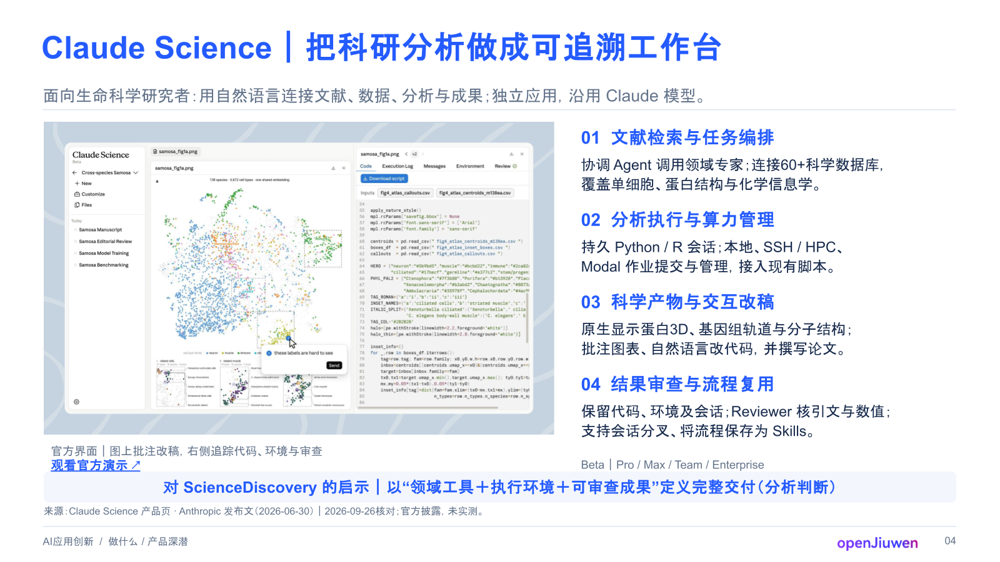

# Default reference-slide style

Use this style by default for the paper/repository deep dive. The user selected
this particular slide; a subsequent explicit template/style choice overrides it.

## Provenance and visual reference

- [Selected Google Slides exemplar](https://docs.google.com/presentation/d/1OwV35KX4m_78F1DxqW-3y7LYVeyGIPHcm9ONU7e82d4/edit?slide=id.aiapp_claude_science_deepdive#slide=id.aiapp_claude_science_deepdive).
- Presentation: `1OwV35KX4m_78F1DxqW-3y7LYVeyGIPHcm9ONU7e82d4`.
- Slide: `aiapp_claude_science_deepdive`, fourth slide at inspection.
- Inspected: 2026-09-26; presentation revision `Q6fPltKze3eq6g`.
- Geometry and text styles were read from the native presentation and checked
  against the selected slide's Google-rendered 1600 × 900 thumbnail.

Inspect this image before building. It preserves the original source slide for
visual comparison; its product text and claims are not evidence for a new deep
dive. The saved image and specification make the style usable without fetching
the online presentation on every invocation. Reinspect the live slide if the
user asks to follow a newer revision.

## Visual system

The composition is a white canvas with blue headings, dark body copy, a large
left visual, a numbered text column on the right, a pale-blue takeaway strip,
and slim source/footer bands. There are no section cards or drop shadows.

| Token | Observed value |
| --- | --- |
| Canvas | 960 × 540 pt, 16:9; approximately 13.333 × 7.5 in |
| Background | `#FFFFFF` |
| Primary blue: title, section headings, link, takeaway text | `#245BFF` |
| Body text | `#182B4D` |
| Muted subtitle, caption, sources, footer | `#64748B` |
| Horizontal rules | `#DCE5F1` |
| Takeaway fill | `#F3F6FD` |
| Font | Arial; verify a compatible CJK fallback when needed |
| Title | 30 pt, bold, left aligned |
| Subtitle | 16 pt, regular |
| Numbered headings | 17 pt, bold |
| Section body | 14 pt, regular, approximately 110% line spacing |
| Takeaway | 15 pt, bold, centered |
| Caption / optional status | 11 pt |
| Optional resource link | 12 pt, bold, underlined |
| Sources / footer | 9.5 pt / 10 pt; auxiliary text only |

Keep body copy at 14 pt or larger on this canvas. Do not enlarge all text to a
universal minimum and lose the hierarchy; equally, do not reuse the source-note
size for narrative text. Shorten copy before reducing type. If a different
canvas size is required, scale coordinates and typography proportionally.

## Geometry and content mapping

All values below are in points on the 960 × 540 canvas. Coordinates are measured
from the top-left corner; rounded values describe the visible design. These are
placement guides, not permission to clip text or stretch images.

| Slot | x, y, width, height | Content for a paper/repository |
| --- | --- | --- |
| Title | 40, 27, 880, 51 | Short paper/repo name followed by its central takeaway |
| Subtitle | 41, 82, 871, about 22 | Problem, audience, or scope in one line |
| Top rule | 41, 105, 877, about 1 | Thin divider |
| Main visual | 42, 117, 490, 301 | Relevant figure, mechanism, dataflow, or comparison |
| Visual caption | 42, 420, 490, about 14 | What the visual demonstrates and its source ID |
| Optional resource link | 42, 433, 490, about 15 | Actual paper, repository, or relevant demo |
| Right-column headings | 551, 115 + 79 × i, 367, 27; i = 0…3 | `01` Problem; `02` Mechanism; `03` Evidence; `04` Limits |
| Right-column body | 551, 143 + 79 × i, 367, 48; i = 0…3 | About two short lines beneath each heading |
| Optional status | 551, 433, 367, about 15 | Source version or a necessary evidence qualification |
| Takeaway bar | 42, 453, 876, 30 | One practical implication, qualified if inferred |
| Source line | 42, 485, 839, about 15 | Short linked source labels and verification status |
| Footer rule | 41, 505, 877, about 1 | Thin divider |
| Footer topic | 41, 514, 540, about 16 | Current topic/category |
| Page number | 896, 513, 22, about 16 | `01` for a standalone one-slide file, or omit |

The approximately 19 pt gutter separates the 490 pt visual from the 367 pt
text column. Keep the right sections visually separate through whitespace and
blue headings. Preserve the bottom takeaway strip as one native rounded box.
Fill the large visual slot with a meaningful visual; do not leave it empty while
crowding the text column. Fit source figures proportionally inside the slot,
keeping their full semantic content and captions readable.

The original optional demo/status text boxes have oversized stored bounds that
extend below the canvas. Use the compact visible rows above instead of copying
those out-of-bounds boxes. Reflow the caption/link rows if the caption wraps.

## Reuse the design and replace the subject

For this local PowerPoint workflow, build native editable objects from the saved
specification. The PNG is a visual reference, never a full-slide background.
If an editable copy of the exemplar is available, preserve its useful local
structure and replace the mapped content in that copy.

- Keep the white background, rules, typography, column proportions, and takeaway
  treatment. Adapt heading labels when another ordering explains the source
  better, while retaining the numbered hierarchy.
- Replace the Claude Science title, subtitle, screenshot, caption, four sections,
  takeaway, resource link, status label, sources, footer category, and page number
  with content supported by the new paper or repository. Omit optional link/status
  slots when they have no relevant content.
- Replace the source screenshot with the relevant paper figure or implementation
  visual. It must carry its own attribution; the exemplar's content is not a
  reusable evidence graphic.
- The original `openJiuwen` footer logo is source-deck branding. Omit it by default
  for a general paper/repo deep dive, or use branding explicitly supplied for
  the new output. Remove unrelated inherited master logos in an editable copy.
- Update all hyperlinks and notes. Record the style provenance in speaker notes
  separately from the factual sources supporting the new deep dive.

Compare the final render with the reference for hierarchy, balance, alignment,
and density. Verify the actual research claims against the new sources. These
are separate checks: matching the appearance does not validate the content.
